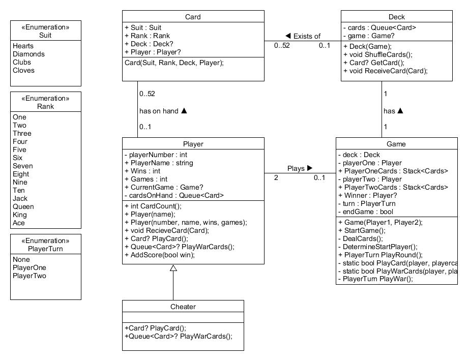
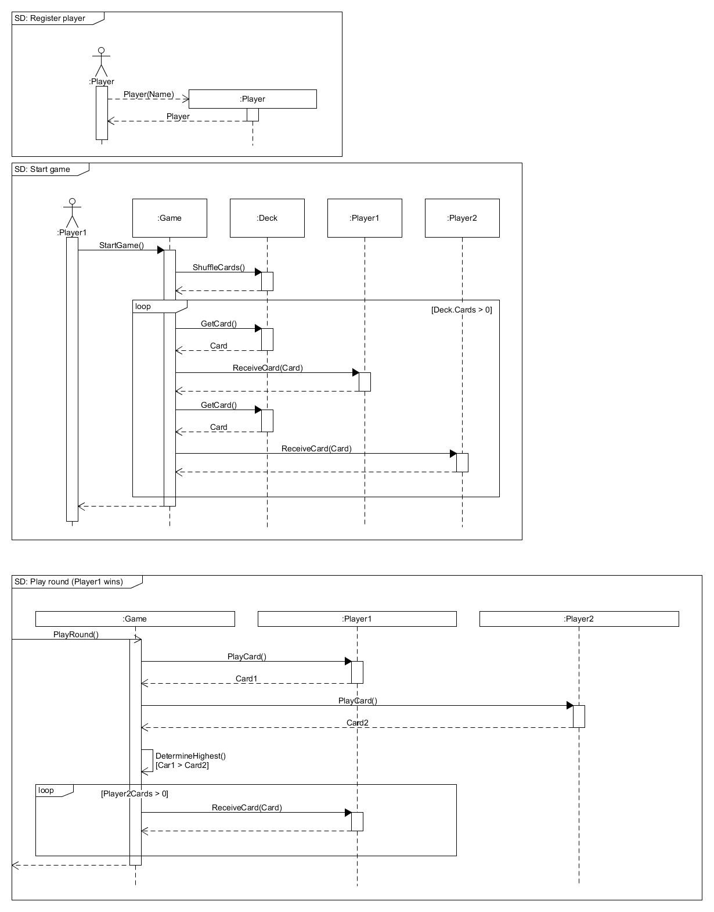

# CardGameWar

## Speluitleg
Oorlog is een kaartspel dat meestal door twee spelers wordt gespeeld en het doel is om alle kaarten te verzamelen. Hier zijn de regels voor het kaartspel oorlog:

- Het spel wordt gespeeld met een standaard deck van 52 kaarten zonder jokers. De kaarten worden geschud en verdeeld over de twee spelers.
- De spelers draaien elk de bovenste kaart van hun stapel om. De speler met de hoogste kaart wint de ronde en verzamelt de twee kaarten. De kaartwaarden worden als volgt gerangschikt: Aas (hoogste kaart), Koning, Vrouw, Boer, 10, 9, 8, 7, 6, 5, 4, 3, 2.
- Als beide spelers kaarten hebben van gelijke waarde, dan begint er een "oorlog". Elke speler legt dan drie kaarten met de rug naar boven op de tafel en draait de vierde kaart om. De speler met de hoogste kaart wint de oorlog en verzamelt alle kaarten van die ronde. Als de kaarten weer gelijk zijn, dan wordt dit proces herhaald.
- Het spel gaat door totdat één speler alle kaarten heeft verzameld. Die speler wint het spel.

Oorlog is een zeer eenvoudig spel zonder veel strategie of tactiek, maar het is leuk om te spelen voor kinderen en beginners die net beginnen met het spelen van kaartspellen.

## Requirements

### Constraints
Onderstaande zijn randvoorwaarden, geen requirements.
- Gegevens worden opgeslagen in Microsoft SQL server
- De applicatie wordt geprogrammeerd in dotnet core met winforms
- Geldende wetgeving wordt nageleefd (eigenlijk overbodig te vermelden)

### Functionele requirements
Requirements geïdentificeerd door nummering met afkorting betekenend: **P**layer, **G**ame, **T**urn, **O**verall
Prioritisering middels MoSCoW in afkorting tussen haakjes toegevoegd. Zie ook:[MoSCoW](https://nl.wikipedia.org/wiki/MoSCoW-methode). 
Opdrachtgever is eigenaar van alle requirements.
Requirements vloeien allen voort uit de bovenstaande speluitleg en doelstelling van het project.

- P1 (S) De speler registreert een unieke naam
- P2 (S) De speler slaat zijn gegevens op

- G1 (C) De speler beëindigt een spel
- G2 (M) De speler kiest een tegenspeler
- G3 (M) De speler start een nieuw spel
- G4 (M) Het spel heeft een standaard deck van 52 kaarten zonder jokers
- G5 (M) De kaarten in het deck hebben een oplopende waarde van 2, 3, 4, 5, 6, 7, 8, 9, 10, B, V, H, A.
- G6 (M) De kaarten worden evenredig random verdeeld
- G8 (S) Het spel bepaalt random de startspeler
- G9 (M) Het spel eindigt zodra één speler geen kaarten meer heeft
- G10 (M) Het spel roept de winnaar uit 
- G11 (S) Het spel werkt de persoonlijke score van de speler bij

- T1 (M) De speler speelt de eerste kaart van zijn stapel op tafel
- T2 (M) De speler met de hoogste kaart wint alle kaarten op tafel
- T3 (M) De gespeelde kaart is van gelijke waarde waardoor oorlog wordt gevoerd
- T3.1 (M) De speler speelt vier kaarten van zijn stapel bij het voeren van oorlog
- T3.2 (M) De waarde van de vierde kaart bepaalt wie de winnaar is
- T4 (M) De speler legt alle gewonnen kaarten onderaan zijn stapel speelkaarten
- T5 (C) Een speler kan vals spelen
- T5.1 (C) De valsspeler speelt in zijn beurt indien beschikbaar een kaart uit zijn stapel die hoger is dan de door de tegenstander gespeelde kaart

- O1 (C) De speler bekijkt de score van alle spelers van hoge score naar lage score
- O2 (C) Het spel kan automatisch gespeeld worden zonder gebruikers interactie (kaarten worden automatisch gelegd)
- O3 (C) De speler slaat het spel tussentijds op
- O4 (C) De speler laadt een eerder opgeslagen spel

### Niet functionele requirements
Niet functionele requirements gaan over kwaliteitskenmerken zoals omschreven in [ISO25010](https://nl.wikipedia.org/wiki/ISO_25010)
- De code is herbruikbaar voor een toekomstige web applicatie (reusability)

## Ontwerp
Ontwerpen zijn gemaakt met UMLet en opgeslagen in de map "Design".
### Conceptueel class diagram

### Implementatie class diagram

### Usecase diagram

### Usecase desciptions
// todo

### Sequence diagrams

### Wireframes
// todo

## Verdieping
Verdiepingsopdrachten voor studenten.
Maak een fork van deze repository en kies één van de onderstaande opdrachten. Idealiter 
- Implementeer requirement T5 en T5.1, de valsspeler (oefenen met afgeleide classes en polymorfisme)
- Implementeer requirement O3 en O4, savegame (oefenen met database en DAL)
